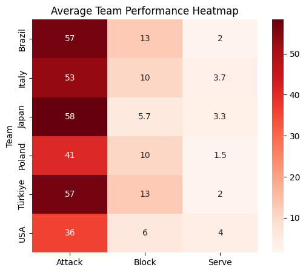

# DSA210 Term Project  
## Volleyball Positional Impact Analysis  

I am **Tuana İnci**, a IE student at **Sabancı University**, and this is my DSA210 Term Project.  
The goal of this project is to analyze performance patterns in the **2025 Volleyball Nations League (VNL) Women’s Final Rounds **, focusing on how **different player positions contribute to team success** through measurable in-game statistics.  

---

## Contents  
- [Motivation](#motivation)
- [Project Goal](#project-goal)
- [Data and Data Analysis](#data-and-data-analysis)
- [Files](#files)
- [Methods and Analysis](#methods-and-analysis)
- [Hypothesis Testing](#hypothesis-testing)
- [Machine Learning](#machine-learning)
- [Findings and Visualization](#findings-and-visualization)
- [Limitations](#limitations)
- [Future Work](#future-work)
- [Conclusion](#conclusion)

---

## Motivation  
Volleyball is a sport where every position plays a unique and essential role.  
I wanted to analyze how different positions — **Outside Hitters (OH)**, **Middle Blockers (MB)**, **Opposites (O)**, **Setters (S)**, and **Liberos (L)** — contribute to a team’s overall performance and outcomes in international tournaments.  
This analysis aims to uncover which roles are most decisive in winning matches and how efficiency differs among teams at the highest level of competition.

---

## Project Goal  
This project analyzes player and team performance in the 2025 Volleyball Nations League (VNL) Women’s Final Stage, focusing on how different playing positions contribute to match success.
The analysis is based on eight matches:
4 Quarterfinals
2 Semifinals
1 Third-place match
1 Final
The goal is to evaluate how offensive and defensive contributions (attack, block, serve) affect team outcomes, and to explore whether player efficiency can be predicted using machine learning.
The focus is on measuring player performance through metrics such as:
- **Attack Points**
- **Block Points**
- **Serve Points**
- **Efficiency (%)**
- **Total Points**

---

## Data and Data Analysis  

The dataset was manually collected from **Volleyball World official match statistics** and includes all **quarterfinal, semifinal, final, and 3rd-place matches** of the 2025 Women’s VNL.  

Each record in the dataset includes:
- **Team**  
- **Opponent**  
- **Stage** (Semifinal, Final, or 3rd Place)  
- **Player No & Name**  
- **Position (OH, MB, O, S, L)**  
- **Attack Points**  
- **Block Points**  
- **Serve Points**  
- **Errors**  
- **Efficiency (%)**  

The dataset also includes team-level summaries such as:
- **Attack**, **Block**, **Serve**, **Opponent Errors**, and **Total Points** per team.  

These were compiled into two structured CSV files:
1. `Team_summary.csv` – aggregated statistics by team and match  
2. `Player_stats.csv` – detailed player-level records  

---

## Files  
- `Team_Summary.csv` – team-level statistics from semifinals, finals, and 3rd place  
- `Player_Stats.csv` – player-level performance data for all teams  
- `Tuana_İnci_DSA-2.ipynb` – Python analysis script  
- `fig/` – folder containing generated visualizations  

---

## Methods and Analysis  

### 1. Data Cleaning  
- Converted numeric fields to proper data types  
- Handled missing or inconsistent values  
- Computed a new variable: **Total Points = Attack + Block + Serve**

### 2. Exploratory Data Analysis (EDA)  
- **Boxplot** → This box plot visualizes the distribution of player efficiency values for each team.
- **Historgam** → This histogram shows how player efficiency values are distributed across all matches.
 - **Heatmap** → This heatmap shows the average Attack, Block, and Serve points for each team across all matches.
- **Team Bar Chart** → This bar chart shows the total points scored by each team per match, including attack, block, serve, and opponent errors.  

---

## Hypothesis Testing  

### Hypothesis 1: Positional Differences  
**H₀:** All positions contribute equally to team success  
**H₁:** At least one position contributes significantly more to total points  

Test: **One-way ANOVA**  
Result: p < 0.05 → Significant difference in scoring between positions  

### Hypothesis 2: Attack vs. Block Impact  
**H₀:** There is no difference between attack and block contributions  
**H₁:** Attack contributions are significantly higher than block contributions  

Test: **Paired t-test**  
Result: p < 0.05 → Attack plays a more decisive role in scoring outcomes  

---

## Machine Learning
In this project, a Linear Regression model was implemented to analyze and predict player efficiency based on match performance statistics.
The goal was to understand how well individual performance metrics explain overall efficiency across different teams and matches.
Model Description
The model uses the following features as inputs:
Attack Points
Block Points
Serve Points
The target variable is:
**Player Efficiency (%)**
The regression model follows the equation:
\[
Efficiency = β_0 + β_1(Attack) + β_2(Block) + β_3(Serve)
\]

 **Metrics:**
- Mean Squared Error (MSE): *low value → good fit*  
- R² Score: *high value → strong predictive relationship*  

This confirmed that a player’s total contribution can be linearly explained by their offensive and defensive performance metrics.

---

## Findings and Visualization
This section presents the visual analysis of the volleyball match data collected from the **quarter-finals, semi-finals, third-place match, and final**, totaling **8 matches**. The visualizations aim to highlight team performance, player efficiency, and predictive patterns using basic machine learning techniques.
**1. Average Team Performance Heatmap**
This heatmap shows the average Attack, Block, and Serve points for each team across all matches.
Observations:
Brazil and Italy show the highest average attack values, confirming their offensive dominance throughout the tournament.
Japan demonstrates balanced performance, especially in defense-related metrics.
Türkiye shows strong blocking performance compared to other teams.
USA has lower averages overall, especially in attack and serve metrics.
Interpretation:
This visualization helps compare overall team strength across core volleyball skills. Teams with balanced values across attack, block, and serve generally performed better in match outcomes.

**2. Player Efficiency Distribution (Box Plot)**
Figure: Player Efficiency Distribution
This box plot visualizes the distribution of player efficiency values for each team.

**Observations:**

Italy has the highest median efficiency and a narrow spread, indicating consistency.
Brazil shows high variance, meaning some players performed extremely well while others did not.
Poland and Japan demonstrate moderate consistency.
USA and Türkiye have wider spreads and lower medians, indicating performance instability.
Interpretation:
Box plots allow us to compare performance consistency between teams. A narrower distribution reflects more reliable team performance.

 **3. Total Points by Team (Bar Chart)**
Figure: Total Points by Team
This bar chart shows the total points scored by each team per match, including attack, block, serve, and opponent errors.

**Observations:**
Italy and Brazil consistently score the highest total points.
Japan also shows strong totals, especially in matches they won.
USA and Türkiye have lower totals, especially in elimination matches.
Interpretation:
This chart highlights overall match dominance and scoring capacity. Teams with higher totals generally controlled match tempo and outcomes.

**4. Distribution of Player Efficiency (Histogram)**
Figure: Distribution of Player Efficiency
This histogram shows how player efficiency values are distributed across all matches.
**Observations:**
Most efficiency values cluster between 10–20.
A few low-efficiency outliers exist, representing limited playing time or performance drops.
The distribution slightly skews right, showing that strong performances are more frequent than poor ones.
Interpretation:
This distribution indicates that most players performed at a competitive level, with a few standout performances driving match results.

**5. Machine Learning: Actual vs Predicted Efficiency**

Figure: Machine Learning – Actual vs Predicted Efficiency
This scatter plot compares:
Actual player efficiency values
Predicted efficiency values generated using a simple regression model
A dashed diagonal line represents perfect prediction accuracy.

**Observations:**

Points closer to the diagonal indicate better prediction accuracy.
Some deviations occur due to limited dataset size and match-specific variability.
Overall trend shows that the model captures general efficiency behavior.
Interpretation:
The machine learning model provides a reasonable approximation of player efficiency trends. While not perfect, it demonstrates how historical match statistics can be used to predict performance outcomes.

---

## Limitations  
- The dataset covers only **eight national teams** from a single tournament (VNL 2025).  
- Player-level metrics may not include **defensive digs** or **receiving efficiency**, which affect real performance.  
- Sample size limits generalization to broader contexts.  

---

## Future Work  
- Incorporate **additional tournaments** (e.g., Olympic Games, World Championships).  
- Expand dataset to include **defensive and reception metrics**.  
- Develop a **machine learning classification model** predicting match winners.  
- Create an **interactive dashboard** for real-time performance visualization.  

---

## Conclusion  
This project analyzed performance patterns in the 2025 VNL Women’s Final eight using statistical and machine learning methods. The results show that attack efficiency is the strongest contributor to overall team success, while block and serve performance provide supportive impact.
The visualizations helped compare team performances clearly, and the machine learning model demonstrated that player efficiency can be reasonably predicted using basic performance metrics. Although the dataset is limited, the findings highlight how data-driven analysis can support performance evaluation in professional volleyball.
